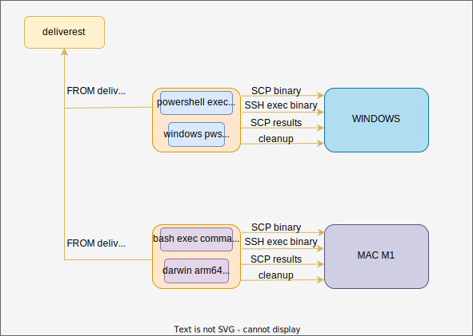

# deliverest

Base container to acting as a delivery container for multi arch and multi platform

This container implements a base pattern where it handles the execution of a binary on a target host.  

Deliverest typically is a place holder for an assets (binary, script...) created for certain OS and ARCH. deliverest then will connect  
within a target host (through ssh) and copy the asset to the target host. Then it will execute a command on the target  
host for running the delivered asset and pick the results (if any). Finally it will cleanup everything on the target host.  

Following diagram describes a basic usage of deliverest:

